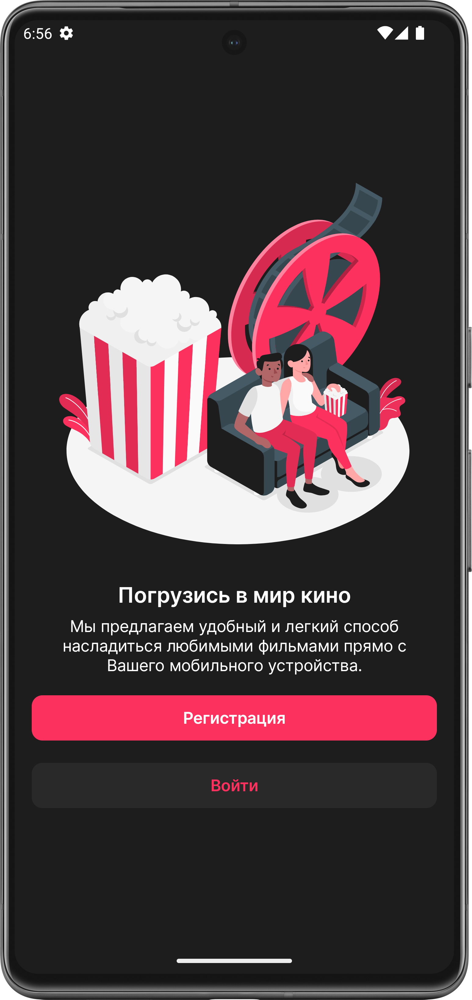
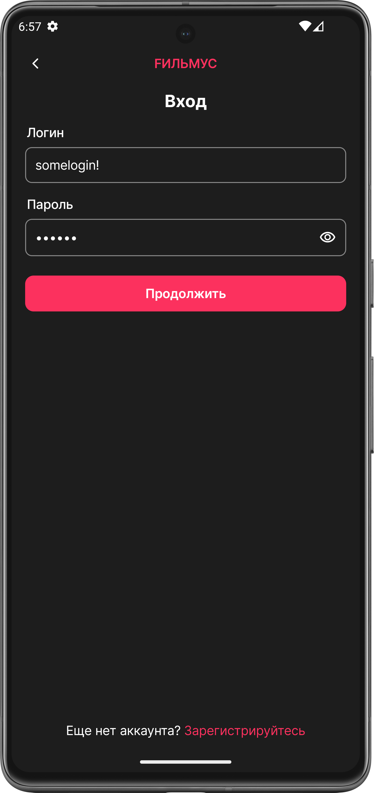
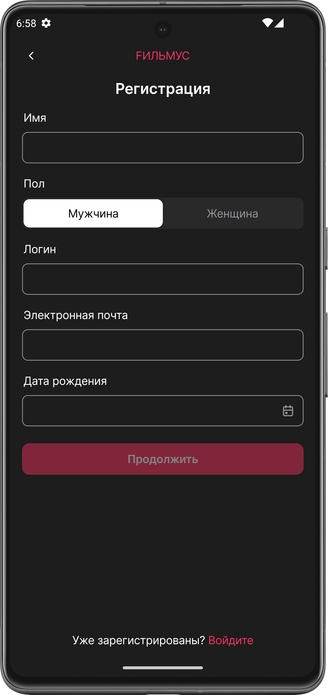
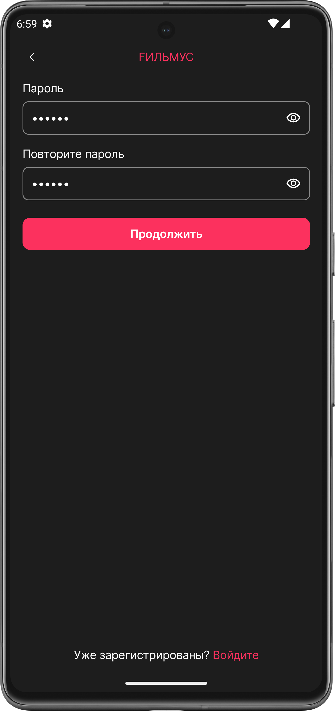
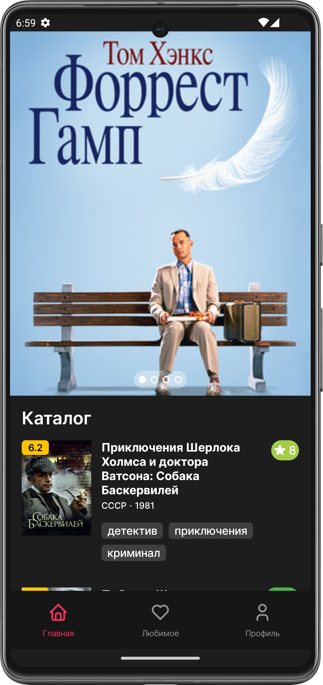
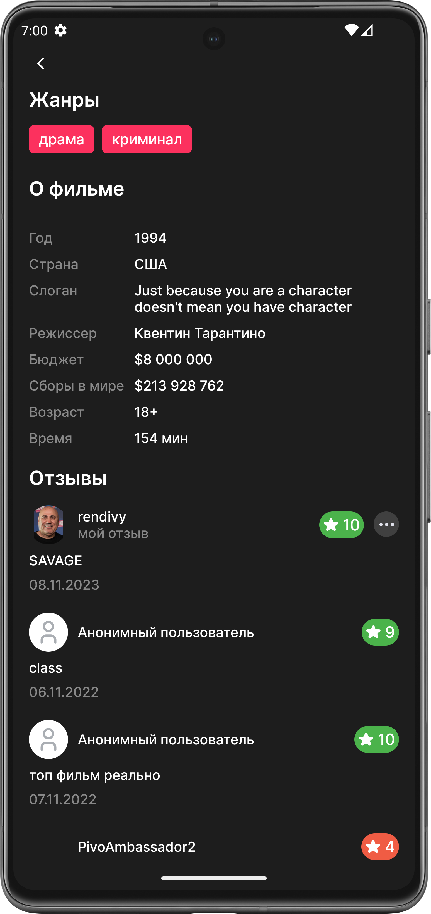
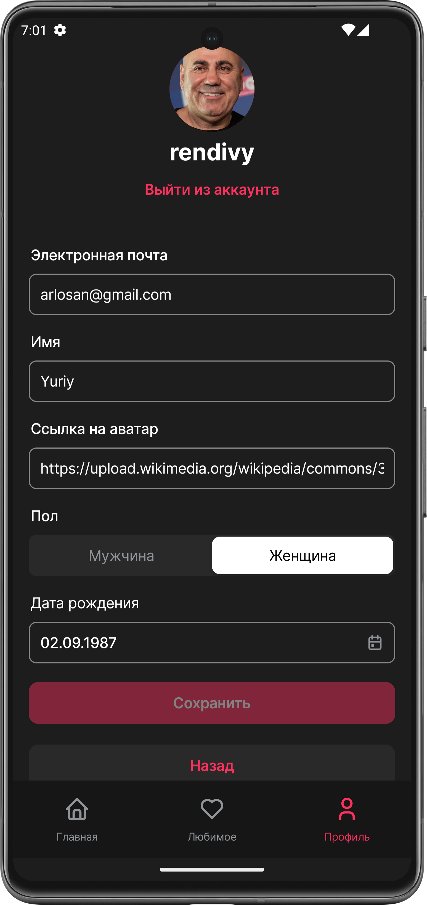

# 🎥 FILMUS - movie catalog 

## 📚 Libraries and tools used
- **Clean Architecture**
- **MVVM**
- **Jetpack Compose**
- **Dependency Injection with Dagger-Hilt**
- **Kotlin Coroutines**
- **Retrofit**
- **ROOM**
- **Accompanist**
- **Material 3**
- **Paging 3**

## 📱 Screenshots
<h3 > Greetings Screen | Login Screen | First registration Screen |  Second registration Screen </h3>

    
    
    
    

<h3 > Home Screen | Film Section | Film details Screen | Favourite movie Screen </h3>

    
    
    
    

<h3 > Profile Screen </h3>

    

